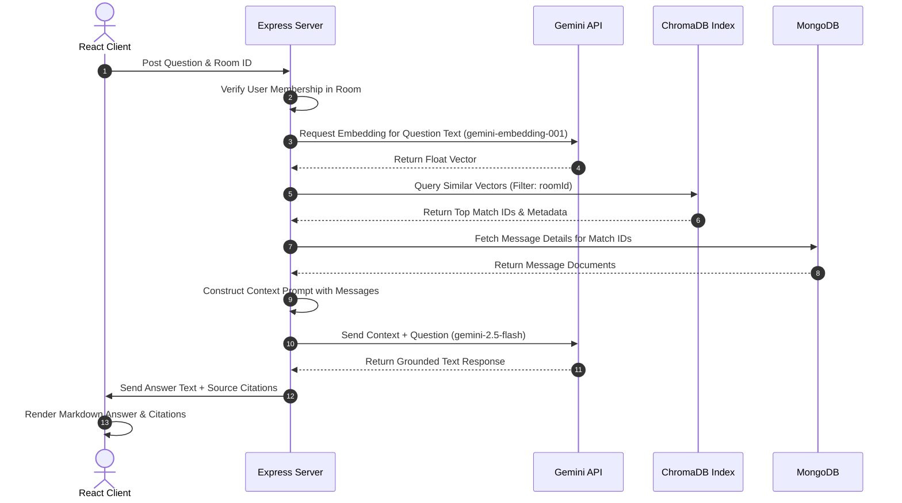
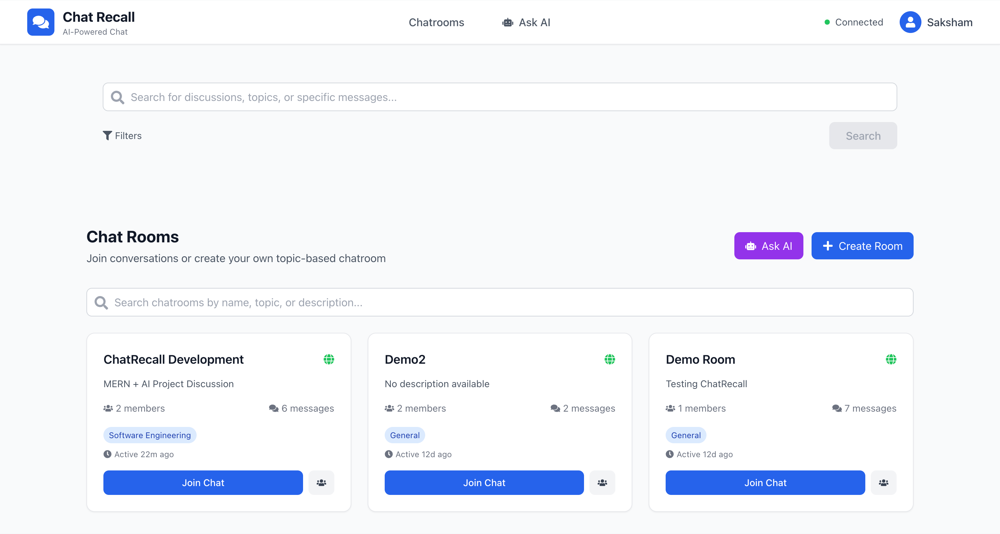
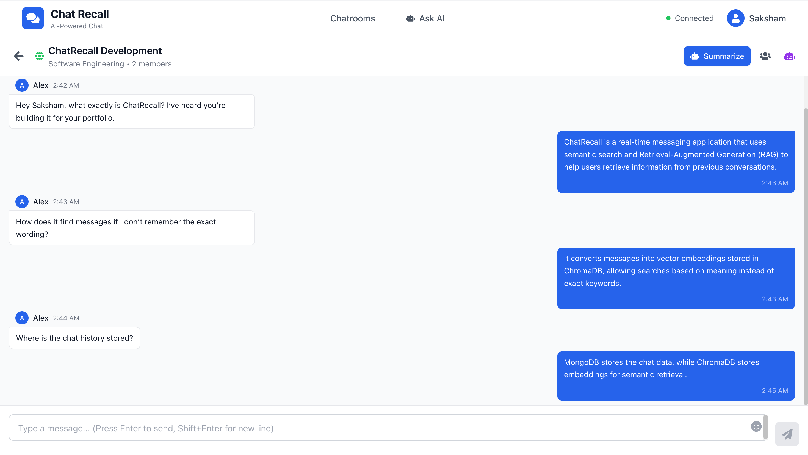
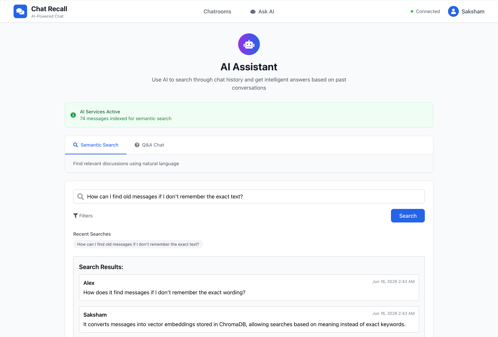
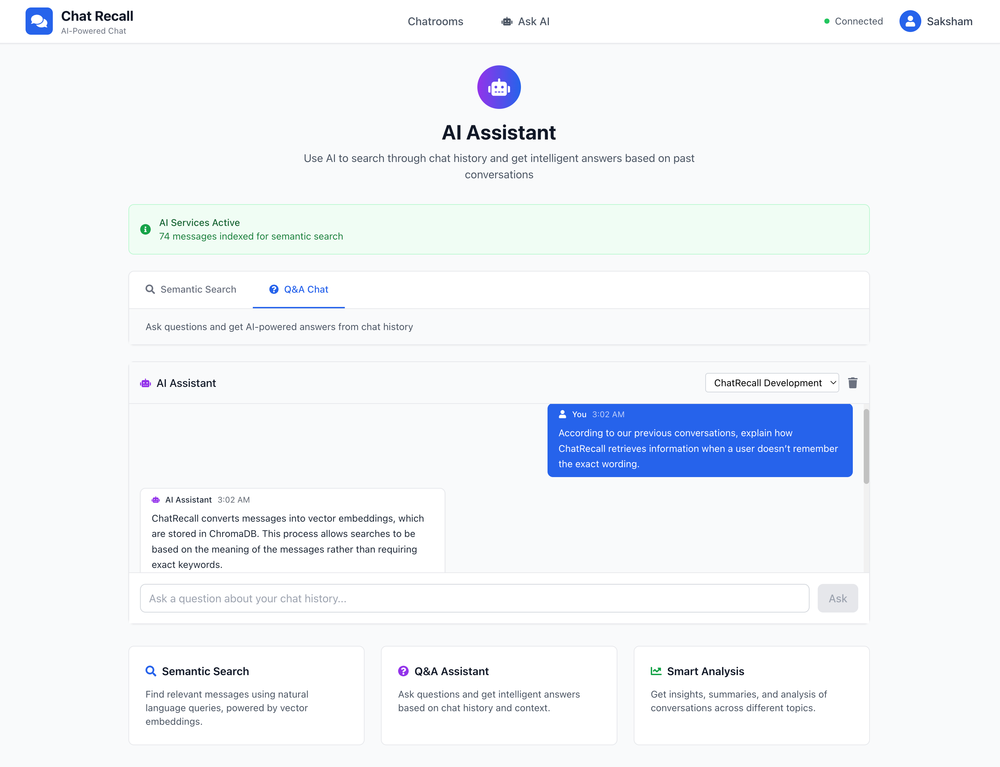
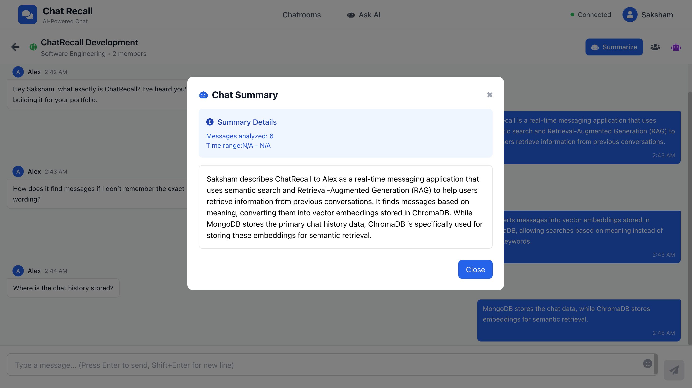

# ChatRecall

### AI-Powered Real-Time Chat with Semantic Retrieval and Retrieval-Augmented Generation (RAG)

[](https://opensource.org/licenses/MIT)
[](https://nodejs.org/)
[](https://react.dev/)
[](https://www.trychroma.com/)
[](https://ai.google.dev/)

**ChatRecall** is a full-stack real-time messaging application featuring AI-powered context retention, semantic message search, and Retrieval-Augmented Generation (RAG) capabilities. The system allows users to recall specific information, extract insights, and ask questions about past conversations. It uses MongoDB as a persistent database, and ChromaDB as a vector store for semantic message indexing.

---

## Table of Contents

1. [Project Overview](#project-overview)
2. [Features](#features)
3. [Tech Stack](#tech-stack)
4. [System Architecture](#system-architecture)
5. [AI Workflow](#ai-workflow)
6. [Semantic Search Workflow](#semantic-search-workflow)
7. [Project Structure](#project-structure)
8. [Performance Considerations](#performance-considerations)
9. [Complete Installation Guide](#complete-installation-guide)
10. [Environment Variables](#environment-variables)
11. [Running the Project](#running-the-project)
12. [Screenshots](#screenshots)
13. [Example Queries](#example-queries)
14. [Security](#security)
15. [Future Improvements](#future-improvements)
16. [Resume Highlights](#resume-highlights)
17. [Learning Outcomes](#learning-outcomes)
18. [Deployment](#deployment)
19. [Contributing](#contributing)
20. [Acknowledgements](#acknowledgements)
21. [License](#license)

---

## Project Overview

### What is ChatRecall?
ChatRecall is a collaborative messaging application that addresses the problem of retrieving historical context in communication platforms. By combining WebSockets messaging with LLM-powered services, it enables users to query their chat history semantically.

### Problem Solved
Traditional chat search relies on exact keyword matching. This approach has limitations:
* **The Synonym Problem:** Searching "database issues" will miss a message containing the phrase "Mongoose query latency was spiking."
* **Conceptual Memory Deficits:** Users often forget the specific words used, remembering only the concept (e.g., "someone explained how to set up the env files").

### Why Semantic Search?
Semantic search represents text based on its meaning (embeddings) rather than matching exact characters. It projects phrases into a high-dimensional vector space where distance corresponds directly to semantic similarity.

### Why AI-Powered Chat Recall is Valuable
By implementing Retrieval-Augmented Generation (RAG) on chat records:
* **Knowledge Recovery:** Users can search and access context without manually scrolling through long histories.
* **Summarization:** Chat logs can be summarized to extract highlights and key action items.
* **Grounded Q&A:** AI answers are grounded in actual conversation records, complete with author and time attributions.

---

## Features

* **JWT Authentication:** Stateless token-based authorization. Tokens are verified on REST API and Socket.IO connections.
* **User Registration/Login:** Interactive forms with password hashing (bcryptjs).
* **Protected Routes:** Frontend navigation guards and backend middleware enforce session presence.
* **Real-time Chat via Socket.IO:** Bidirectional communication with message delivery, online user indicators, and room joining/leaving events.
* **Chatroom Management:** Create public or private rooms and manage access rights.
* **MongoDB Persistence:** Mongoose-modeled storage for users, chatrooms, and messages, acting as the primary database.
* **AI Chat Summarization:** Gemini-powered summaries that process chat transcripts to generate key highlights.
* **Semantic Search:** Text embedding matching that queries ChromaDB vectors using a similarity metric to find related messages.
* **ChromaDB Vector Database:** A vector database that indexes message vectors alongside metadata filters for room-level isolation.
* **Retrieval-Augmented Generation (RAG):** Connects semantic search with LLM generation to answer user queries using relevant chat context.
* **Gemini Integration:** Utilizes `gemini-embedding-001` for generating embeddings and `gemini-2.5-flash` for summaries and Q&A responses.
* **Source Attribution:** Each AI response includes references to the source messages, showing the sender, room, content, and timestamp.
* **Room-based Access Control:** Restricts search and Q&A results so users can only retrieve messages from rooms they are authorized to access.
* **Automatic Message Indexing:** After a message is persisted, the backend asynchronously generates embeddings and indexes them into ChromaDB.
* **Responsive React Frontend:** Built with React and Tailwind CSS, featuring standard hooks, loading indicators, and alerts.

---

## Tech Stack

### Frontend
* React
* React Router
* Axios
* Tailwind CSS
* Socket.IO Client

### Backend
* Node.js
* Express.js
* Socket.IO
* JWT
* Mongoose

### Database
* MongoDB

### AI
* Google Gemini
* ChromaDB
* Vector Embeddings
* Semantic Search
* Retrieval-Augmented Generation (RAG)

---

## System Architecture

The following diagram illustrates how requests flow between components during real-time chat, background indexing, and RAG execution:

```text
  [ Frontend React App ]
            |
            | (Socket.IO & Axios REST API)
            v
     [ Express API ]
            |
            +---> [ JWT Authentication Middleware ]
            |
            +---> [ MongoDB Persistence ] (Primary Database: Users, Rooms, Messages)
            |
            +---> [ Gemini API ] (Embedding Generation / LLM Reasoning)
            |
            v
     [ ChromaDB Store ] (Vector Indices & Metadata Filters)
```

### Flow Description
1. **Client Actions:** The user logs in via the Express REST endpoints and connects to the WebSocket server using Socket.IO.
2. **Real-time Message Flow:** A user sends a message. The backend validates the JWT and room access, saves the message to MongoDB, broadcasts it to room members, and initiates indexing.
3. **Indexing Pipeline:** After a message is persisted, the backend asynchronously requests an embedding from Gemini and stores the vector in ChromaDB along with metadata (`roomId`, `userId`, `username`, `timestamp`).
4. **RAG Flow:** When a user asks a question, the query is embedded, relevant messages are retrieved from ChromaDB (filtered by `roomId`), and those messages are sent to Gemini as context to generate an answer.

---

## AI Workflow

The execution steps for Retrieval-Augmented Generation are:



---

## Semantic Search Workflow

### How Embeddings Work
An embedding maps a piece of text to a high-dimensional vector. Words or phrases with similar semantic meaning are mapped close together in this vector space.

### Why Vector Search is Superior to Keyword Search
Unlike string matching, which relies on matching exact characters, vector search calculates similarity in embedding space. This allows retrieval of conceptually related messages even when they do not share any words.

### Similarity Search Conceptually
The system measures semantic closeness using **Cosine Similarity**:

$$\text{Cosine Similarity} = \frac{\mathbf{A} \cdot \mathbf{B}}{\|\mathbf{A}\| \|\mathbf{B}\|}$$

Where $\mathbf{A}$ is the query vector and $\mathbf{B}$ is the message vector. A cosine value of `1.0` indicates identical semantic direction, while values closer to `0.0` or negative indicate divergence. ChromaDB returns the matches sorted by similarity, which is calculated based on the distance metric configured.

---

## Project Structure

<details>
<summary>📂 View Folder Tree and Responsibility Directory Map</summary>

```text
ChatRecall/
├── backend/
│   ├── config/              # Database and Chroma configurations
│   ├── middleware/          # JWT auth, Socket auth, and security headers
│   ├── models/              # Mongoose schemas (User, Message, Chatroom)
│   ├── routes/              # HTTP endpoint routers (auth, message, ai, chatrooms)
│   ├── services/            # Logic wrappers for Gemini and ChromaDB
│   ├── utils/               # Helper utilities
│   ├── server.js            # Main Express & Socket.IO server
│   └── package.json         # Backend dependencies
│
├── frontend/
│   ├── public/              # Static assets
│   └── src/
│       ├── components/      # UI components (Auth, Chat, AI, Layout)
│       ├── context/         # React contexts (Auth, Socket)
│       ├── services/        # Axios API client setup
│       ├── App.jsx          # Route configuration
│       └── index.js         # React DOM entrypoint
│
└── start_chromadb.py        # Python script to run ChromaDB locally
```
</details>

---

## Performance Considerations

* **Decoupled Datastores:** MongoDB stores persistent chat records, while ChromaDB stores vector embeddings. This separates transactional storage from vector retrieval.
* **Bounded Retrieval:** Semantic search retrieves only the top relevant messages rather than loading full logs.
* **Efficiency:** Only the retrieved context is sent to the LLM (Gemini). This reduces latency and token usage compared to sending the entire chat history.

---

## Complete Installation Guide

Follow these steps to set up and run the application on a fresh machine.

### Step 1: Install Git
Verify if Git is installed, or install it:
* **macOS:** Open a terminal and run `git --version`. If not present, follow the prompts or install Homebrew (`brew install git`).
* **Windows:** Download the installer from the official [Git Website](https://git-scm.com/).
* **Linux:** Run `sudo apt update && sudo apt install -y git`.

### Step 2: Install Node.js
Install Node.js (version 18 or higher):
* **macOS:** Run `brew install node`.
* **Windows:** Download the installer from the [Node.js Website](https://nodejs.org/).
* **Linux:** Run `sudo apt install -y nodejs npm`.
* **Verify:** Run `node -v` and `npm -v`.

### Step 3: Install MongoDB
Install MongoDB Community Edition:
* **macOS:**
  ```bash
  brew tap mongodb/brew
  brew install mongodb-community@7.0
  ```
* **Windows/Linux:** Download and install MongoDB Community Server from the official MongoDB page.

### Step 4: Install Python and ChromaDB
ChromaDB requires Python:
1. Ensure Python 3.8+ is installed.
2. Clone the repository and navigate into it:
   ```bash
   git clone https://github.com/sakshamagg28/ChatRecall.git
   cd ChatRecall
   ```
3. Set up a Python virtual environment and activate it:
   ```bash
   python3 -m venv venv
   source venv/bin/activate  # On Windows: .\venv\Scripts\Activate.ps1
   ```
4. Install ChromaDB:
   ```bash
   pip install chromadb
   ```

### Step 5: Install Project Dependencies
Install the required Node.js packages for the backend and frontend:
* **Backend:**
  ```bash
  cd backend
  npm install
  ```
* **Frontend:**
  ```bash
  cd ../frontend
  npm install
  ```

---

## Environment Variables

Create a `.env` file in the `backend/` and `frontend/` directories.

### Backend (`backend/.env`)
```env
PORT=5050
NODE_ENV=development
MONGODB_URI=mongodb://localhost:27017/chatrecall
JWT_SECRET=your_secure_jwt_secret
GEMINI_API_KEY=your_gemini_api_key
CHROMADB_URL=http://localhost:8000
VECTOR_COLLECTION=chat_vectors
FRONTEND_URL=http://localhost:3000
```

### Frontend (`frontend/.env`)
```env
REACT_APP_API_URL=http://localhost:5050/api
REACT_APP_SOCKET_URL=http://localhost:5050
```

---

## Running the Project

### Start Databases
Ensure MongoDB and ChromaDB are active before starting the application:
* **Start MongoDB:**
  * **macOS:** `brew services start mongodb-community`
  * **Linux:** `sudo systemctl start mongod`
* **Start ChromaDB:**
  From the project root directory (ensure the Python virtual environment is active):
  ```bash
  python start_chromadb.py
  ```

### Development Mode
* **Run Backend:**
  ```bash
  cd backend
  npm run dev
  ```
* **Run Frontend:**
  ```bash
  cd frontend
  npm start
  ```
* **Verify Application:** Open `http://localhost:3000` in your browser. Register an account, create a chatroom, send messages, and verify semantic search and AI Q&A.

### Production Mode
1. Compile the frontend build:
   ```bash
   cd frontend
   npm run build
   ```
2. Set `NODE_ENV=production` and configure a strong `JWT_SECRET` in `backend/.env`.
3. Start the backend:
   ```bash
   cd backend
   npm start
   ```

### Resetting Services
* **Reset MongoDB:**
  ```bash
  mongosh
  # In the shell:
  use chatrecall
  db.dropDatabase()
  ```
* **Reset ChromaDB:** Delete the local database folder:
  ```bash
  rm -rf ./chroma
  ```

---

## 📸 Screenshots

### Dashboard
Displays available chatrooms, room details, and quick access to AI-powered features.



---

### Real-Time Chat Interface
Real-time messaging interface powered by Socket.IO with support for AI conversation summarization.



---

### Semantic Search
Search previous conversations using natural language instead of exact keywords through vector embeddings stored in ChromaDB.



---

### AI Q&A Assistant
Ask questions about previous conversations and receive context-aware answers generated using Retrieval-Augmented Generation (RAG).



---

### AI Chat Summary
Generate concise summaries of chatroom discussions using Gemini AI.



---

## Example Queries

Below are typical questions to test semantic retrieval:

| Query Type | Sample Input | Expected Retrieve Target |
| :--- | :--- | :--- |
| **System Check** | *"What database does this project use?"* | Messages discussing Node, Mongoose, and MongoDB. |
| **Architecture** | *"What framework is used for frontend?"* | Messages discussing React, components, or CSS frameworks. |
| **Summarization**| *"Summarize yesterday's chat"* | Historical logs from the previous day. |
| **Decisions** | *"What topics were discussed?"* | Key team discussions and decision agreements. |
| **Task Actions**| *"What issues were discussed?"* | Debug statements or errors reported in chat. |

---

## Security

* **JWT Verification:** Authenticates both HTTP REST requests and Socket.IO handshakes.
* **Room Authorization:** Validates user membership on backend actions to restrict room retrieval access.
* **Input Validation:** Enforces Mongoose schemas to prevent database injection.
* **Password Hashing:** Hashes passwords with `bcryptjs` before storage.
* **Rate Limiting & Security Headers:** Implements rate-limiting middleware to protect endpoints from abuse, and configures basic HTTP response headers to protect API endpoints.
* **No Secrets Committed:** Relies entirely on environment variables loaded at runtime.

---

## Future Improvements

* **Unit Tests:** Write backend and frontend component tests.
* **Hybrid Search:** Implement keyword search alongside semantic vector search.
* **Multi-modal search:** Support image uploads and vision processing.
* **File Attachments:** Store and link document uploads in chat.
* **Cloud Deployment:** Transition to managed container services.

---

## Resume Highlights

* **Full-Stack Architecture:** Built a real-time chat client using React and a modular Express server, establishing communication via authenticated Socket.IO connections.
* **Retrieval-Augmented Generation (RAG):** Orchestrated a RAG query flow using the Google Gemini API to produce context-grounded, source-attributed responses from chat logs.
* **Vector Storage & Metadata Filtering:** Configured ChromaDB to store message embeddings and execute semantic queries with active metadata filtering for room-level isolation.
* **Data Modeling & Schema Integrity:** Structured Mongoose models for users, messages, and chatrooms in MongoDB to maintain session data and persistent chat history.
* **API Security & Request Lifecycle:** Configured JSON Web Token validation for both REST requests and WebSocket handshakes, combined with custom rate-limiting and security header middleware.

---

## Learning Outcomes

* **State Synchronization:** Synchronized real-time server broadcasts from Socket.IO with React component state to ensure low-latency message rendering.
* **Asynchronous Integration Patterns:** Handled background vector indexing operations asynchronously following database storage events without blocking primary message delivery.
* **Prompt Construction & Context Bounds:** Structured strict system instructions and context inputs for LLM generation to reduce hallucinations and verify facts against historical messages.
* **Resource Optimization:** Utilized vector similarity search to select only relevant context messages, reducing model token usage and request latency.

---

## Deployment

The application can be deployed using the following services:
* **Frontend:** Vercel, Netlify, or AWS Amplify
* **Backend:** Render, Railway, or Fly.io
* **Primary Database:** MongoDB Atlas
* **Vector Store:** Self-hosted or cloud-managed ChromaDB

---

## Contributing

Contributions, bug reports, and suggestions are welcome. Feel free to fork the repository and open a pull request.

---

## Acknowledgements

This project is built using:
* [React](https://react.dev/)
* [Express.js](https://expressjs.com/)
* [MongoDB](https://www.mongodb.com/)
* [Socket.IO](https://socket.io/)
* [ChromaDB](https://www.trychroma.com/)
* [Google Gemini API](https://ai.google.dev/)

---

## License

This project is licensed under the MIT License.
